[](https://bolt-series.cn/prompt/)

<a href="https://bolt-series.cn/prompt/">
  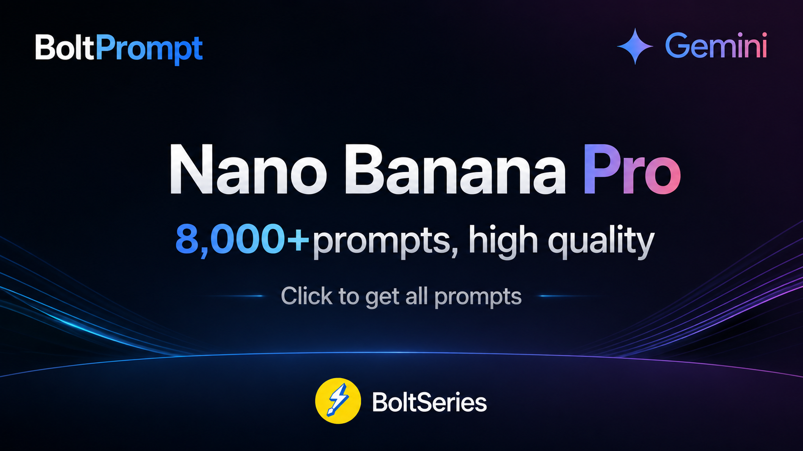
</a>

# Nano Banana Pro 提示词库

**BoltPrompt** 面向图像类 AI 创作，整理了 **八千余条精选提示词**：覆盖多种创作场景与风格，开箱即可在浏览器中浏览——**轻快、直观、不乱**。

> 🔗 **立刻体验**：[https://bolt-series.cn/prompt/](https://bolt-series.cn/prompt/)  
> ⚠️ **版权声明**：所有提示词均收集自社区，仅供教育目的使用。如果您认为任何内容侵犯了您的权利，请[提交 issue](https://github.com/zhengzhoujiao/BoltPrompt-nanobanana-prompts/issues/new?template=bug-report.yml)，我们将立即移除。

---

| 功能 | 优势 |
|--|--|
| **精选海量** | 收录 **8000+** 条高质量提示词条目 |
| **专业分类** | 按侧边栏的主题与场景归档，逐级浏览更清晰 |
| **提示词管理** | 浏览器本地 **分组管理** 常用提示词：收藏、独立编辑、导入导出、自定义，打造你的专属提示词库 |
| **实时检索** | 支持关键字搜索标题、中英文提示词、署名等字段，快速对齐你的需求 |
| **所见即所用** | 卡片式预览配图，条目详情里 **一键复制** 提示词正文 |
| **轻快体验** | 页面精简、无明显门槛，手机和桌面都能舒服使用 |

---

## 🤔 项目说明

BoltPrompt 围绕下面几条打磨体验：

- **持续更新**：词条与栏目长期增补、校对，跟上常用玩法与画风。  
- **高品质精选**：按「真正能落地使用」为标准筛选，把好用的句子集中呈现。  
- **提示词管理**：本地分组与独立副本，适合把公用词条沉淀为个人常用工作集，并支持 JSON 备份、修改和自定义。  
- **极简界面设计**：排版做减法——层级清爽、噪声少，视觉先落到内容上，移动端友好。  
- **快速检索**：关键词即时可查，顺着标题与中英正文、署名等字段迅速对齐场景。  
- **最纯粹的提示词库**：少套路、少花活，专注「收录 · 浏览 · 一键复制」，把主线留给提示词本身。

### ⚡️项目启动

**1、提示词数据集下载**：[点击下载提示词，并且解压到项目根目录](https://github.com/zhengzhoujiao/BoltPrompt-nanobanana-prompts/releases/tag/v1.0.0)

**2、启动服务**：在本目录打开终端，执行：

```bash
python server.py
```

终端会提示访问地址（默认为 **`http://localhost:8080`**）。用浏览器打开该地址即可；

---

## 📂 提示词目录

- [浏览全部内容](https://bolt-series.cn/prompt/)
- [建筑室内空间设计](https://bolt-series.cn/prompt/?cat=01_%E5%BB%BA%E7%AD%91%E5%AE%A4%E5%86%85%E7%A9%BA%E9%97%B4%E8%AE%BE%E8%AE%A1)
  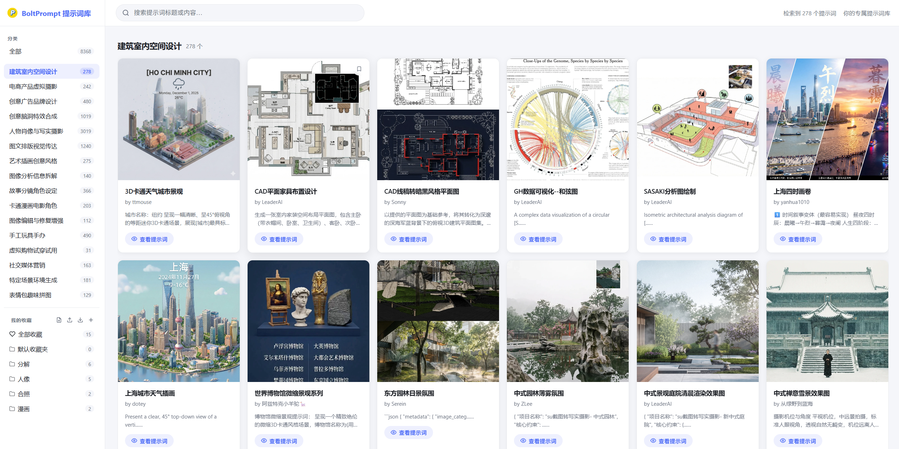
- [电商产品虚拟摄影](https://bolt-series.cn/prompt/?cat=02_%E7%94%B5%E5%95%86%E4%BA%A7%E5%93%81%E8%99%9A%E6%8B%9F%E6%91%84%E5%BD%B1)
  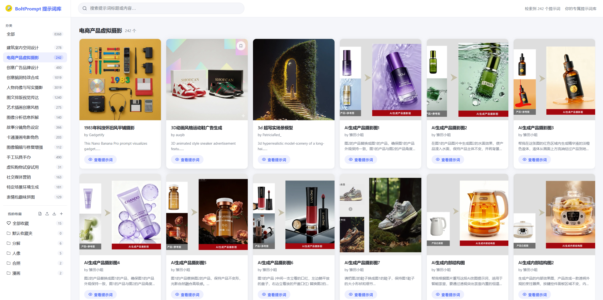
- [创意广告品牌设计](https://bolt-series.cn/prompt/?cat=03_%E5%88%9B%E6%84%8F%E5%B9%BF%E5%91%8A%E5%93%81%E7%89%8C%E8%AE%BE%E8%AE%A1)
  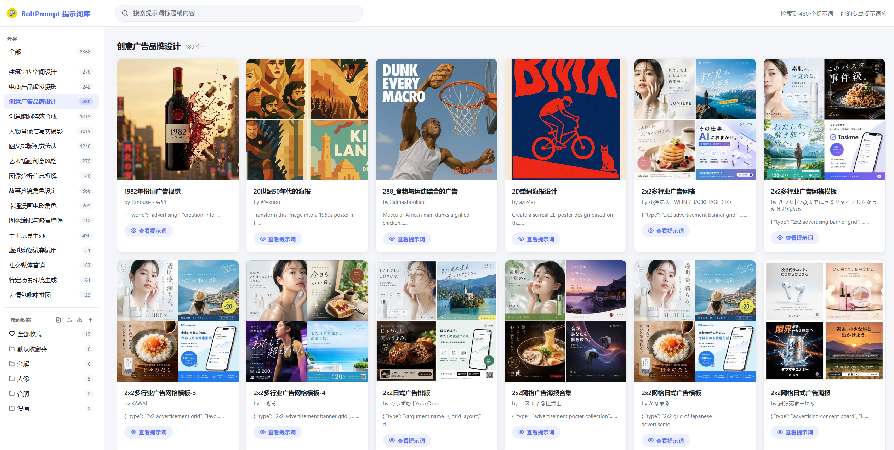
- [创意脑洞特效合成](https://bolt-series.cn/prompt/?cat=04_%E5%88%9B%E6%84%8F%E8%84%91%E6%B4%9E%E7%89%B9%E6%95%88%E5%90%88%E6%88%90)
  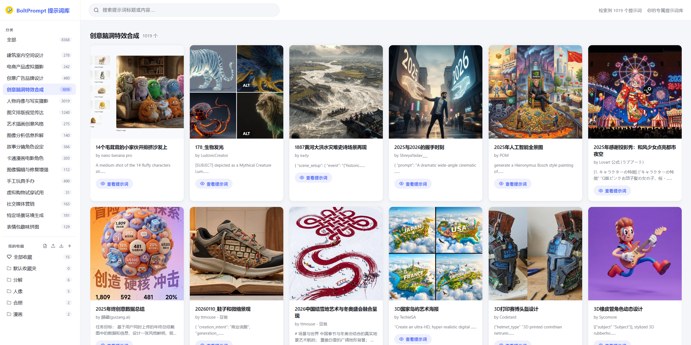
- [人物肖像与写实摄影](https://bolt-series.cn/prompt/?cat=05_%E4%BA%BA%E7%89%A9%E8%82%96%E5%83%8F%E4%B8%8E%E5%86%99%E5%AE%9E%E6%91%84%E5%BD%B1)
  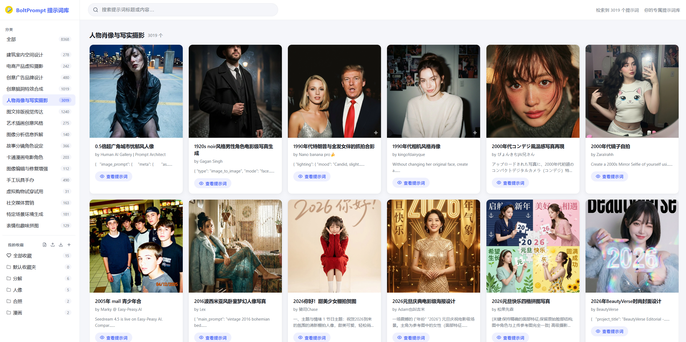
- [图文排版视觉传达](https://bolt-series.cn/prompt/?cat=06_%E5%9B%BE%E6%96%87%E6%8E%92%E7%89%88%E8%A7%86%E8%A7%89%E4%BC%A0%E8%BE%BE)
  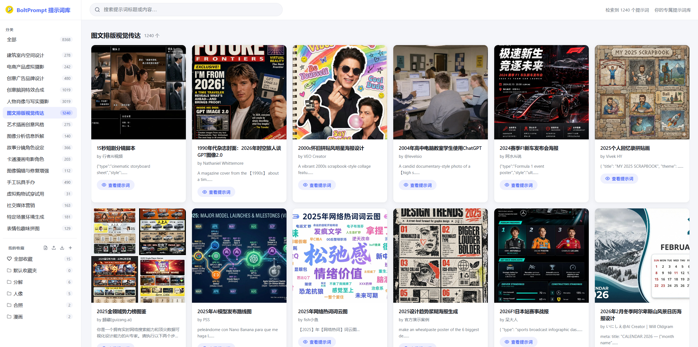
- [艺术插画创意风格](https://bolt-series.cn/prompt/?cat=07_%E8%89%BA%E6%9C%AF%E6%8F%92%E7%94%BB%E5%88%9B%E6%84%8F%E9%A3%8E%E6%A0%BC)
  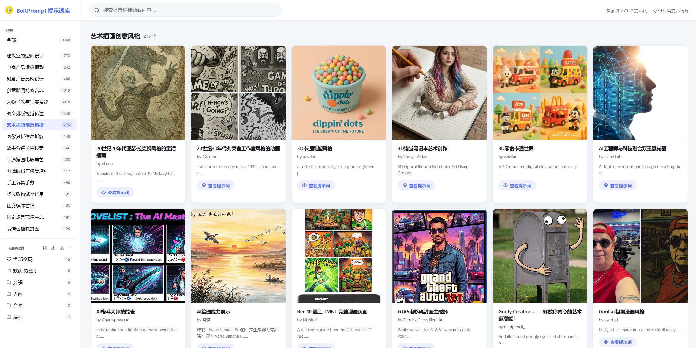
- [图像分析信息拆解](https://bolt-series.cn/prompt/?cat=08_%E5%9B%BE%E5%83%8F%E5%88%86%E6%9E%90%E4%BF%A1%E6%81%AF%E6%8B%86%E8%A7%A3)
  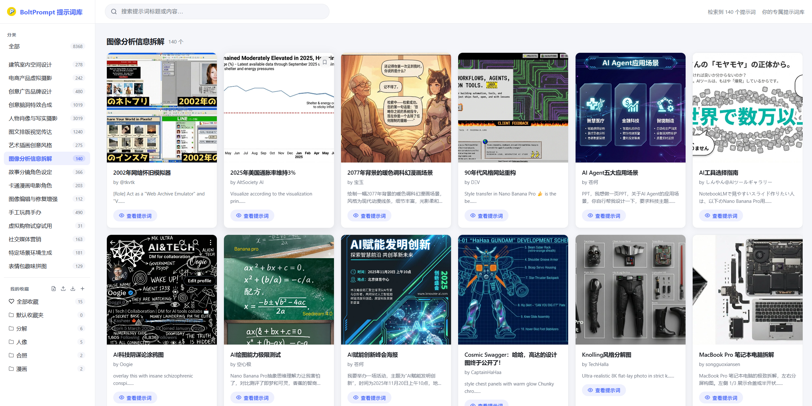
- [故事分镜角色设定](https://bolt-series.cn/prompt/?cat=09_%E6%95%85%E4%BA%8B%E5%88%86%E9%95%9C%E8%A7%92%E8%89%B2%E8%AE%BE%E5%AE%9A)
  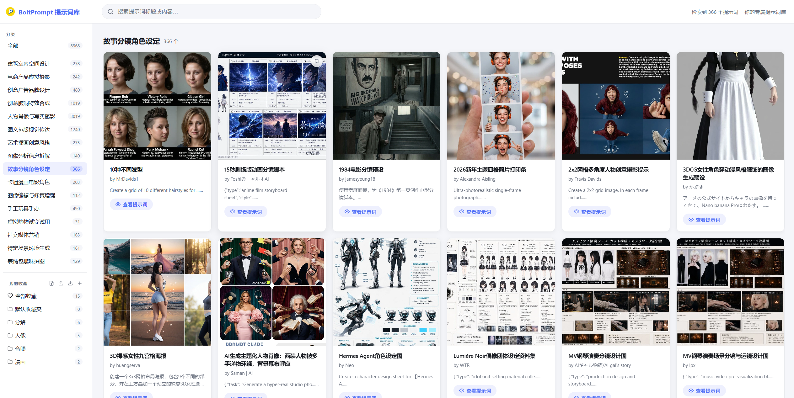
- [卡通漫画电影角色](https://bolt-series.cn/prompt/?cat=10_%E5%8D%A1%E9%80%9A%E6%BC%AB%E7%94%BB%E7%94%B5%E5%BD%B1%E8%A7%92%E8%89%B2)
  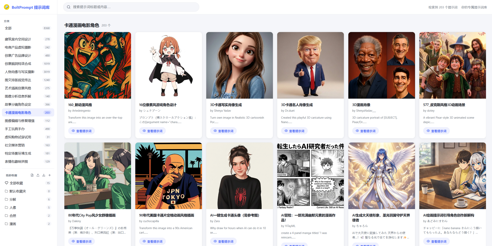
- [图像编辑与修复增强](https://bolt-series.cn/prompt/?cat=11_%E5%9B%BE%E5%83%8F%E7%BC%96%E8%BE%91%E4%B8%8E%E4%BF%AE%E5%A4%8D%E5%A2%9E%E5%BC%BA)
  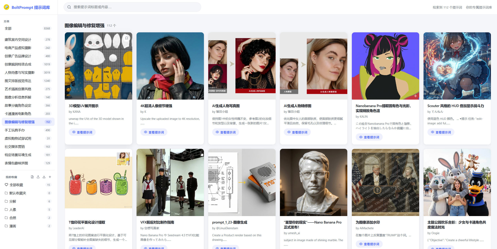
- [手工玩具手办](https://bolt-series.cn/prompt/?cat=12_%E6%89%8B%E5%B7%A5%E7%8E%A9%E5%85%B7%E6%89%8B%E5%8A%9E)
  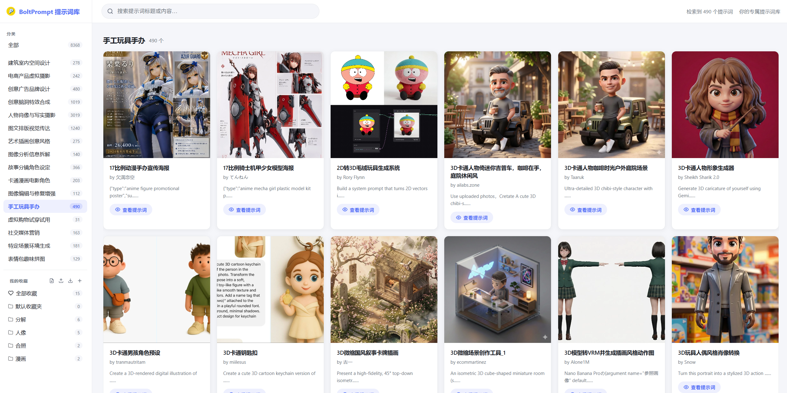
- [虚拟购物试穿试用](https://bolt-series.cn/prompt/?cat=13_%E8%99%9A%E6%8B%9F%E8%B4%AD%E7%89%A9%E8%AF%95%E7%A9%BF%E8%AF%95%E7%94%A8)
  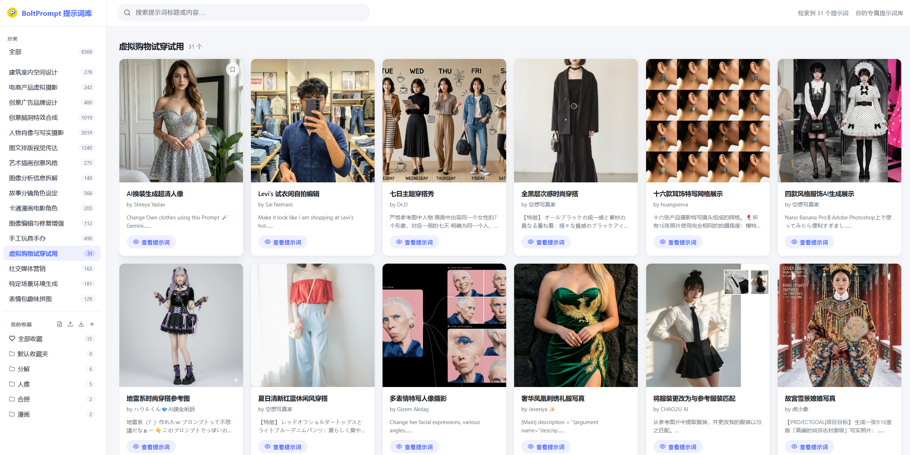
- [社交媒体营销](https://bolt-series.cn/prompt/?cat=14_%E7%A4%BE%E4%BA%A4%E5%AA%92%E4%BD%93%E8%90%A5%E9%94%80)
  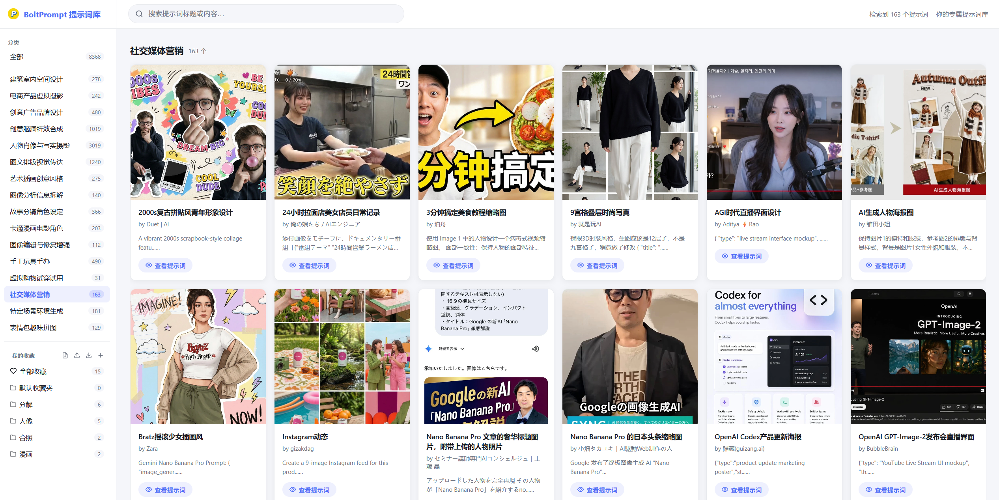
- [特定场景环境生成](https://bolt-series.cn/prompt/?cat=15_%E7%89%B9%E5%AE%9A%E5%9C%BA%E6%99%AF%E7%8E%AF%E5%A2%83%E7%94%9F%E6%88%90)
  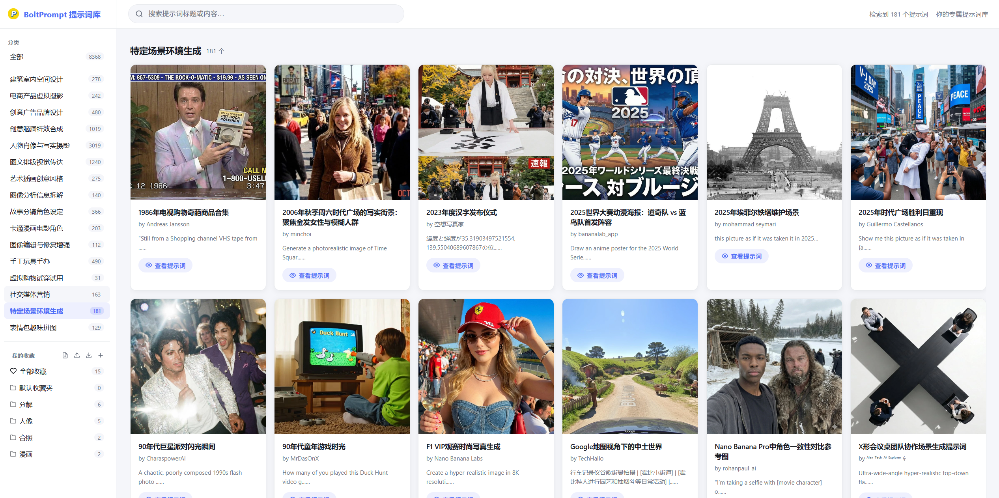
- [表情包趣味拼图](https://bolt-series.cn/prompt/?cat=16_%E8%A1%A8%E6%83%85%E5%8C%85%E8%B6%A3%E5%91%B3%E6%8B%BC%E5%9B%BE)
  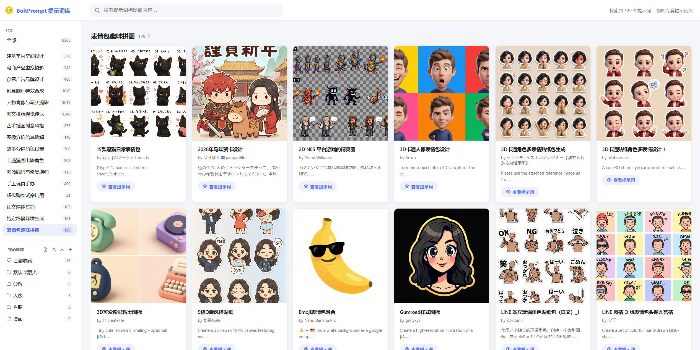

---

## 🤝 如何贡献

我们欢迎贡献！您可以通过以下方式提交提示词：

### 🐛 GitHub Issue

1. Click [**提交新提示词**](https://github.com/zhengzhoujiao/BoltPrompt-nanobanana-prompts/issues/new?template=submit-prompt.yml)
2. 填写表单，包含提示词详情和图片
3. 提交并等待团队审核
4. 如果通过审核（我们会添加 `approved` 标签），它将自动同步到 CMS
5. 您的提示词将在 4 小时内出现在 README 中

**注意：** 我们仅接受通过 GitHub Issues 提交的内容，以确保质量控制。
